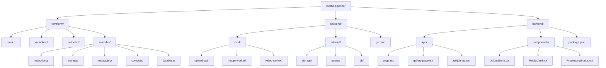

# Media Pipeline Architect

Use this skill for system-level design work on a media processing platform built with Next.js, AWS, Go, Terraform, SQS, S3, DynamoDB, Lambda, API Gateway, ALB, and CloudFront.

## Invoke when

- The user wants a project plan, architecture breakdown, or build order.
- The task spans multiple layers such as frontend, backend, infrastructure, and operations.
- You need to choose between event flow patterns, storage layout, queue topology, or deployment boundaries.
- You need to turn a rough idea into modules, services, phases, or implementation milestones.

## Core responsibilities

1. Convert product intent into concrete platform components.
2. Define data flow from upload to processed delivery.
3. Separate responsibilities across frontend, API, worker, and infrastructure layers.
4. Identify cross-cutting concerns such as security, retries, idempotency, tracing, and cost control.
5. Recommend delivery order that reduces risk and preserves a working vertical slice early.

## Architecture guidance

- Prefer direct browser-to-S3 uploads with presigned URLs to avoid routing large payloads through the API.
- Treat the upload API as control-plane logic: issue presigned URLs, create job records, validate metadata, and return stable identifiers.
- Use DynamoDB for job state with a predictable lifecycle such as `PENDING`, `UPLOADED`, `PROCESSING`, `COMPLETE`, `FAILED`.
- Use SQS between ingestion and processors to isolate spikes, enable retries, and support different worker types.
- Separate raw and processed storage buckets or prefixes to simplify IAM, lifecycle rules, and CDN policies.
- Serve processed assets from CloudFront and keep origin access private.
- Design workers to be idempotent because SQS and Lambda are at-least-once.

## Recommended decomposition

- `terraform/`: infrastructure modules and environment composition
- `backend/cmd/upload-api/`: presign and job creation
- `backend/cmd/image-worker/`: image resize, compress, watermark
- `backend/cmd/video-worker/`: transcode, thumbnail generation
- `backend/internal/`: shared AWS clients, config, models, and helpers
- `frontend/app/`: upload flow, gallery, job polling, result views

## Project structure diagram

## Decision checklist

- How are media types classified and routed to the correct worker?
- What is the maximum upload size and how is it enforced?
- What makes a job idempotent?
- What timeout, visibility timeout, and DLQ thresholds fit each worker?
- Which CloudFront paths are public versus signed or restricted?
- Where are source and output object keys stored and how are versions represented?

## Expected outputs

When using this skill, produce one or more of:

- system architecture description
- build order by phase
- module boundaries
- API contract suggestions
- queue and worker strategy
- risk list with mitigations

## Example prompts

- `Design the media pipeline architecture for image and video processing on AWS.`
- `Break this upload + SQS + Lambda system into delivery phases.`
- `Review whether this media processing architecture is missing any failure handling or security controls.`
